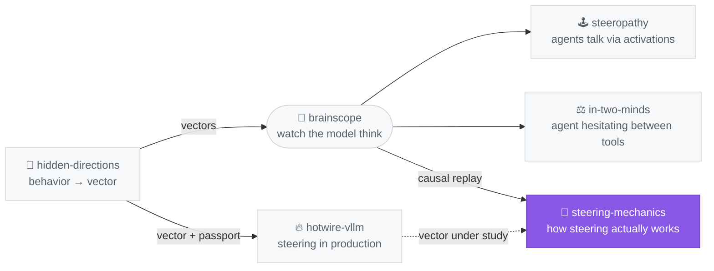

# steering-mechanics

**Mechanistic inspection of steering vectors**, driven
through [brainscope](https://github.com/moudrkat/brainscope)'s HTTP API.
Scripts here are thin clients — the GPU work happens on the $GPU_HOST box, this
repo holds experiments, aggregated results, and notes.

Division of labor (why this repo exists):

- **brainscope** (OSS) — generic *instruments*: `/replay {forced: true}`
  teacher-forced causal diff, `/directions/{name}/unembed` direct logit
  attribution, per-token cos & J-lens capture.
- **[hidden-directions](https://github.com/moudrkat/hidden-directions)** —
  the *factory*: extract, auto-calibrate (`hidden-directions calibrate` —
  the optimizer this repo prototyped), bake, audit.
- **this repo** — *experiments on specific vectors*: dose–response
  curves, direct-vs-circuit splits, component attribution, patching studies.
- app-specific eval scaffolds and traces never enter this repo — experiments
  either use the neutral prompts baked into scripts, or reference private
  scaffold files at runtime via `$SCAFFOLD_JSON` (results derived from them
  land in `results/`, which is gitignored for text-bearing files).


## ⚡ Run in 30 s (no GPU)

**Install** (Python ≥ 3.10):

```bash
pip install -e .        #  or:  make install
```

**Then:**

```bash
make demo               #  == python -m steermech.plot
```

renders real measured results into `fig/` from the shipped `examples/`:
the L21 attention-head tug-of-war (`tug_of_war.gif`), the dose-response
curve, and the attn-vs-MLP component split. This is the whole point in one
picture before you set anything up.

## Live experiments (needs a GPU)

The experiments measure a *live* model through
[brainscope](https://github.com/moudrkat/brainscope)'s HTTP API — that is
where the GPU work happens. Start one and point the scripts at it:

```bash
# on a GPU box:
pip install brainscope   # or clone the repo
brainscope --model Qwen/Qwen3-4B-Instruct-2507 --jlens <lens.pt> --port 8010

# then, anywhere:
export BRAINSCOPE_BASE=http://<gpu-host>:8010
```

**No private data required.** brainscope loads example directions on start
(and can mint one from a word via `/jlens/direction`), so you can calibrate
and dissect a public vector immediately:

```bash
# discover what any loaded direction does, then calibrate it:
hidden-directions discover-intent --key mine --id <direction-name> --layer 20
hidden-directions calibrate --key mine --id <direction-name> --trials 40
# (steermech-discover / steermech-calibrate still work as aliases)
```

Prefer zero setup? A Colab notebook that spins up brainscope on a rented
GPU and runs the whole thing: [`colab_demo.ipynb`](colab_demo.ipynb).

## The program (in order of depth)

1. **Dose–response** (`experiments/dose_response.py`) — forced diff at
   scales 0.5→6: does suppression scale linearly, then saturate? Measures
   the vector's operating range instead of guessing it.
2. **Direct vs circuit** (`experiments/direct_logit.py`) — `W_U·v` top
   movers vs what steering actually suppressed at matched positions. The
   overlap ratio is the single most informative number about *how* the
   vector works: direct logit push vs circuit-mediated suppression.
2b. **Tuned-lens quantification** — replace the top-5 set-membership
   readout with tuned-lens Δ log-prob per layer/position (brainscope has a
   fitted tuned lens for Qwen3-4B in `lenses/`). Continuous instead of
   binary: no rank-6 blindness, and dose–response gets a real y-axis.
   Needs the forced pass to expose tuned-lens readouts. TODO.
3. **Component attribution** — which sublayer (attn vs MLP) at L21 amplifies
   the injected delta (the peak lands one layer after injection). Needs a
   small brainscope extension to the forced pass (record probe norms per
   forced position). TODO.
4. **Head-level** — which attention heads move the vector's content between
   positions; where "why did the concept survive at position X" gets its
   real answer. TODO.
5. **Activation patching** — steered L20 residual patched into the clean run
   at single positions; which position's patch flips the output token. The
   forced-pass scaffolding is ~80 % of this harness. TODO.

## Runbook: how to continue tomorrow

Everything below assumes a GPU box reachable as `$GPU_HOST` (set `BRAINSCOPE_BASE=http://$GPU_HOST:8010` for the experiment scripts; concrete personal values live in `notes/local-runbook.md`, which is gitignored). **The GPU runs ONE
thing at a time** — hotwire-vLLM (the app backend) or brainscope (the lab).

```bash
# 0) what is on the GPU right now?
ssh $GPU_HOST 'nvidia-smi --query-compute-apps=pid,process_name --format=csv,noheader'

# 1) stop whatever holds the GPU
ssh $GPU_HOST 'nvidia-smi --query-compute-apps=pid --format=csv,noheader | xargs -r kill -9'

# 2a) start BRAINSCOPE (lab: replay, forced diff, unembed) — port 8010
ssh $GPU_HOST 'cd $BRAINSCOPE_DIR && setsid nohup env \
  HF_HOME=$HF_CACHE HF_HUB_OFFLINE=1 \
  PYTHONPATH=. .venv/bin/python launch_bs.py > ~/bs_replay.log 2>&1 < /dev/null &'
curl -s http://$GPU_HOST:8010/info          # wait until it answers
curl -s -X POST http://$GPU_HOST:8010/jlens -d '{"on": true}' \
  -H 'Content-Type: application/json'          # J-lens on for disposition diffs

# 2b) or start HOTWIRE-VLLM (app backend) — port 8001
ssh $GPU_HOST 'setsid nohup env HF_HOME=$HF_CACHE \
  HF_HUB_OFFLINE=1 VLLM_USE_FLASHINFER_SAMPLER=0 \
  HOTWIRE_VECTORS=$VECTORS_DIR HOTWIRE_SLOTS=128 \
  $VLLM_VENV/bin/vllm serve Qwen/Qwen3-4B-Instruct-2507 \
  --port 8001 --served-model-name qwen3-8b qwen3-4b --max-model-len 32768 \
  --gpu-memory-utilization 0.85 --enable-auto-tool-choice \
  --tool-call-parser hermes > ~/hotwire-serve.log 2>&1 < /dev/null &'

# 3) run an experiment (brainscope must be up)
python3 experiments/dose_response.py --scales 0.5 1.5 3 6
python3 experiments/direct_logit.py

# 4) IMPORTANT: hand the GPU back to the app when done (repeat 1 + 2b)
```

Key locations:
- vectors served to both backends: `$GPU_HOST:$VECTORS_DIR/*.pt`
  (+ source of truth `$GPU_HOST:$DIRS_JSON`)
- brainscope deploy on $GPU_HOST: rsync `brainscope/server.py` →
  `$GPU_HOST:tmp/brainscope-test/brainscope/server.py`, then restart (step 1+2a)
- figures & their HTML sources: `<brainscope>/notes/steering_*.{html,png}`
  (re-render: `google-chrome --headless=new --screenshot=X.png
  --window-size=1200,H --force-device-scale-factor=2 file://$PWD/X.html`)
- application-side evals and parity live in the application's own
  (private) repo — this repo stays app-agnostic


## Auto-calibration (heretic-grade, for any vector)

> **Moved to the factory.** The calibration core (client, efficacy/damage
> eval, intent discovery, the Optuna loop) now lives in
> [hidden-directions](https://github.com/moudrkat/hidden-directions) as
> `hidden_directions.calibrate` — calibration is part of *making* a vector,
> so the factory owns it end-to-end (`extract → calibrate → bake → audit`).
> The scripts below still work as thin wrappers; install the core with
> `pip install "hidden-directions[calibrate] @ git+https://github.com/moudrkat/hidden-directions"`
> (or use this repo's `pip install -e ".[calibrate]"`). The canonical entry
> point is `hidden-directions calibrate`.

The method, in one line — the same way [heretic](https://github.com/p-e-w/heretic)
calibrates abliteration — co-minimizing two axes on **two separate
datasets**, so efficacy and model-damage never get conflated:

    objective = efficacy_miss  +  lambda * damage_KL

- **efficacy** — did the vector achieve its intent? Measured on a small
  set of *eliciting* prompts against the vector's `avoid`/`target` concepts.
  Per-vector: `data/vectors/<key>.intent.json`.
- **damage** — did steering break normal behavior? Mean **KL divergence**
  from the unsteered model on one shared, vector-agnostic **benign set**
  (`data/benign_prompts.txt`). This is heretic's key trick: KL on benign
  inputs is a fast proxy for "did I damage general capability", no
  benchmark run needed.

Bring your own vector — the intent is **auto-discoverable**, no hand-labeling:

    # 1. discover what the vector suppresses/promotes -> intent file
    hidden-directions discover-intent --key myvec --id my_direction --layer 20
    # 2. calibrate (layer, scale) by co-minimizing miss + lambda*KL
    hidden-directions calibrate --key myvec --id my_direction --trials 40

`make_intent.py` runs the vector strongly over the benign prompts and
harvests the concepts it most reliably removes — turning *any* vector into
a calibratable one. (heretic knows a priori it targets refusals; here the
target is discovered from the vector itself.)

Pure scoring logic is unit-tested server-free — in hidden-directions
(`tests/test_calibrate.py`), next to the code.

## External methods

Not everything here is home-grown. [heretic](https://github.com/p-e-w/heretic)
(automatic directional ablation / "abliteration", Arditi et al. 2024, with
Optuna-driven parameter search co-minimizing refusals and KL divergence)
plugs in at four points:

1. **The inverse experiment** — this repo studies *adding* a direction;
   heretic *removes* one from the weights. Running the forced-diff program
   on an ablated model asks whether the circuit's self-repair is symmetric.
2. **KL divergence as the damage metric** — adopting heretic's
   quality-control idea as the dose–response y-axis ("what a dose costs in
   intelligence"), replacing coarse coherence heuristics.
3. **TPE auto-calibration** *(implemented — now shipped as `hidden-directions calibrate`)*
   — heretic's Optuna loop, pointed at a steering eval: (layer, scale) found
   by co-minimizing behavioral miss + KL divergence, the same principled
   damage guardrail heretic uses for abliteration. Manual sweep → optimizer.
4. **A community reference vector** — the Arditi-style refusal direction as
   an externally defined subject for the whole program: is the MLP
   self-repair universal, or vector-specific?
## Where this sits in the lab



*Highlighted = this repo. The full lab map (with the two other repos' stories) lives on [moudrkat](https://github.com/moudrkat).*

